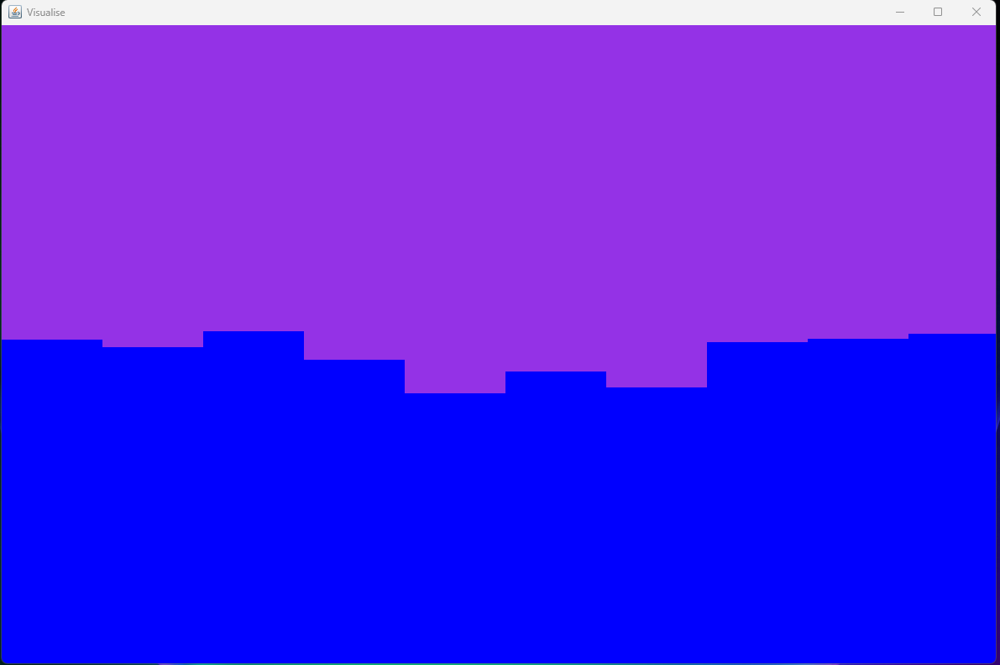
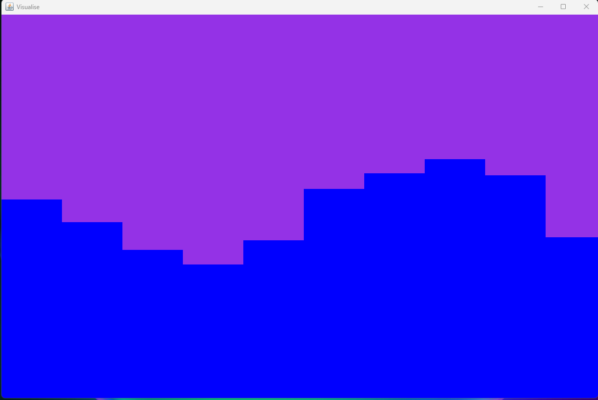
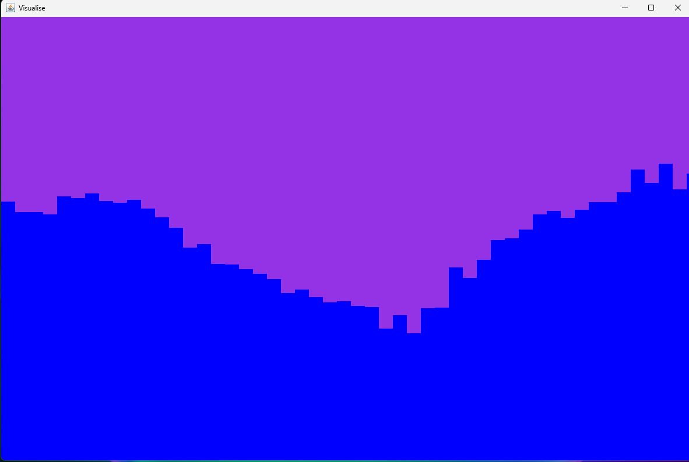
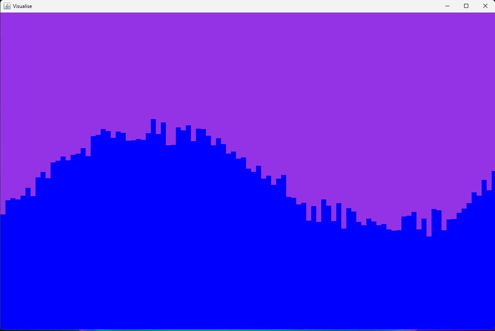
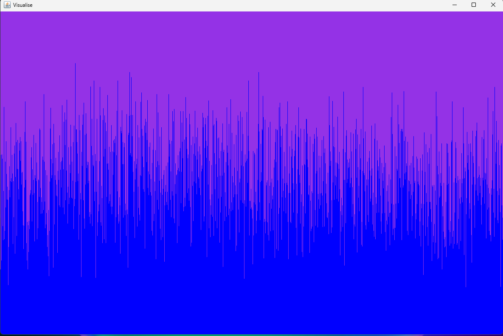
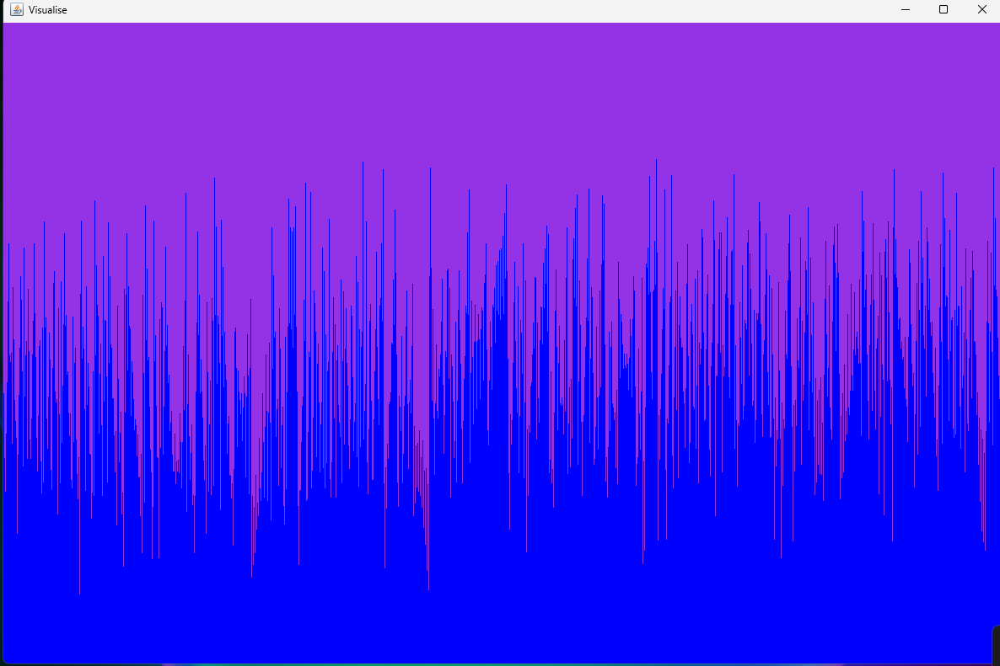
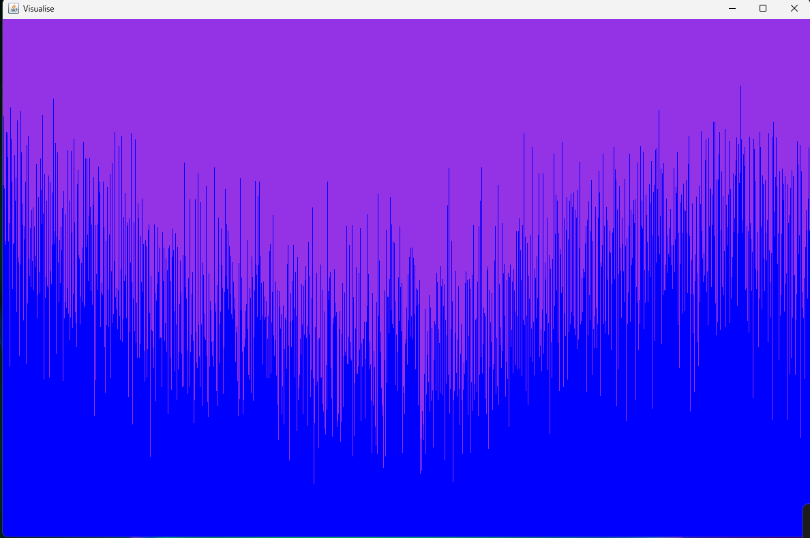

# Music Visualiser
________________
Excite your home listening now :)
______________
Dynamic visual expierence for your listen... and watching pleasure!
_____________
V1. Framework for the app. Choose-able window size and resolution of waves. < 100 for lower resolution, giving a retro feel. Higher resolution, best to pick window width in order for them to display properly. 
*Picking a resolution that is perfectly divisable by the window width! 
__________
Resolution - 10

Resolution -20

Resolution - 50

Resolution - 100

Resoltion - 1200 max fidelity 

